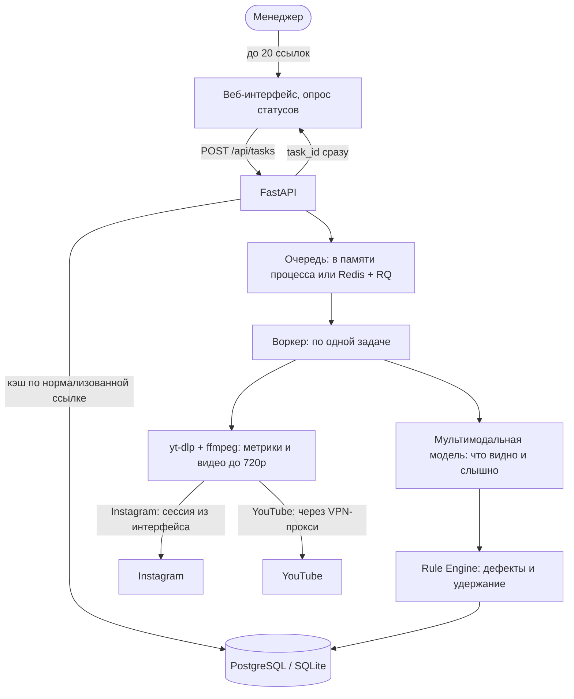

# Skycoach Reels Ad Analyzer

Сервис для инфлюенс-менеджеров Skycoach: по ссылке на ролик собирает метрики и определяет, есть ли в нём реклама Skycoach, насколько она заметна и корректно ли размещён баннер.

- **Развёрнутый сервис:** https://videoalalizer.onrender.com
- **Репозиторий:** https://github.com/andreimelneichuk/Videoalalizer
- **Swagger:** https://videoalalizer.onrender.com/docs

> Сервис живёт на бесплатном тарифе Render и засыпает после 15 минут без запросов. Первое открытие после сна занимает до минуты — это не поломка.

## Что делает

Принимает до 20 ссылок за раз (Instagram Reels, YouTube Shorts), обрабатывает их в фоне и по каждому ролику показывает:

1. **Метрики:** просмотры, лайки, комментарии, дата публикации, автор. Недоступная метрика показывается как `N/A`, а не как ноль.
2. **Класс интеграции:** 0 — про Skycoach ничего нет; 1 — Skycoach упоминается, но продукт не рекламируется; 2 — рекламируется продукт.
3. **Заметность 1–5 с обоснованием:** сколько секунд баннер в кадре, какую долю кадра занимает, был ли голосовой или текстовый призыв, какой промокод.
4. **Дефекты размещения баннера и удержание из выплаты** по регламенту из `banner_review_examples.pdf`.

Результаты можно выгрузить в CSV (`/api/export/csv`).

## Архитектура



Ключевые решения:

- **Модель только наблюдает, деньги считает код.** Модель возвращает факты: секунды, координаты баннера, наличие призыва, правильный ли логотип. Дефекты размещения и процент удержания вычисляет детерминированный `SkycoachRuleEngine` по координатам баннера. Так удержание не зависит от настроения модели и покрывается тестами.
- **Два режима очереди.** `QUEUE_BACKEND=redis` — отдельный воркер RQ (docker-compose). `QUEUE_BACKEND=memory` — очередь внутри веб-процесса, задачи выполняются по одной в отдельном потоке; нужен для хостинга с одним контейнером. Незавершённые задачи после перезапуска возвращаются в очередь из базы.
- **Кэш по нормализованной ссылке.** Из ссылки убираются `igsh`, UTM и прочие параметры; повторная отправка отдаёт готовый результат с `is_cached: true` и не запускает обработку.
- **Сессия Instagram задаётся в интерфейсе.** Она проверяется перед сохранением, дублируется в базу и восстанавливается после перезапуска. Между запросами к Instagram выдерживается пауза 15–25 секунд, чтобы сессию не заблокировали за всплески.
- **YouTube идёт через VPN.** С IP хостинга YouTube требует подтвердить, что это не бот. В контейнере поднимается клиент VLESS (sing-box) с локальным SOCKS-прокси; через него ходит только анонимный YouTube, Instagram и cookies — напрямую.

## Как запустить локально

### Docker Compose (веб + воркер + Redis)

```bash
git clone https://github.com/andreimelneichuk/Videoalalizer.git
cd Videoalalizer
cp .env.example .env   # впишите OPENAI_API_KEY (ключ OpenRouter)
docker-compose up --build
```

Интерфейс: http://localhost:8080, Swagger: http://localhost:8080/docs.

### Один процесс без Redis

Нужны Python 3.11+, `uv` и `ffmpeg`.

```bash
uv sync --extra dev
QUEUE_BACKEND=memory uv run uvicorn src.main:app --port 8080
```

### Тесты

```bash
uv run pytest -q
```

112 тестов: правила удержаний (включая сверку с ручной разметкой), экстрактор, API, воркер, очередь в памяти, сохранение сессии, разбор VLESS-ссылок, приёмочные сценарии.

### Основные переменные окружения

| Переменная | Назначение |
|---|---|
| `OPENAI_API_KEY`, `OPENAI_BASE_URL`, `OPENAI_MODEL` | Любой OpenAI-совместимый провайдер мультимодальной модели |
| `DATABASE_URL` | SQLite по умолчанию; строка подключения PostgreSQL принимается как есть |
| `QUEUE_BACKEND` | `redis` (по умолчанию) или `memory` |
| `VLESS_URL` | Ссылка `vless://` или адрес подписки: поднимает прокси для YouTube |
| `YOUTUBE_PROXY` | Готовый прокси для YouTube вместо `VLESS_URL` |
| `IG_MIN_INTERVAL_SEC`, `IG_JITTER_SEC` | Пауза между запросами к Instagram |

Полный список — в [.env.example](.env.example).

## Внешние сервисы и почему они

| Сервис | Что делает | Почему выбран |
|---|---|---|
| **yt-dlp + ffmpeg** | Метрики и видео до 720p | Бесплатный, поддерживает Instagram и YouTube, отдаёт типизируемые ошибки (приватный, удалённый, нужна авторизация). Платный скрейпер не понадобился. |
| **OpenRouter, модель `qwen/qwen3.8-omni-flash`** | Анализ видеоряда и звука одним запросом, второй запрос — точные координаты баннера | Принимает видео со звуком, поэтому не нужен отдельный Whisper. Эталонный логотип Skycoach передаётся в запрос, чтобы отличать чужие логотипы. Провайдер меняется переменными окружения. |
| **Render (free)** | Хостинг контейнера | Бесплатный, деплой из репозитория по `render.yaml`. |
| **Neon (free)** | PostgreSQL | Диск на бесплатном Render временный; Neon бессрочно хранит задачи и сессию Instagram. |
| **Личный VPN (VLESS)** | Выход в YouTube | YouTube блокирует IP хостинга; бесплатные публичные прокси оказались нерабочими. |

## Правила удержаний

| Дефект | Удержание | Как определяется |
|---|:---:|---|
| Дефектов нет | 0% | — |
| Баннер обрезан по краю | 20% | Баннер вплотную к левому, правому или верхнему краю кадра |
| Перекрыт интерфейсом приложения | 20% | Не менее 25% площади баннера под шапкой приложения или колонкой боковых кнопок Reels/Shorts |
| Немного мелковат | 20% | Площадь от 5,0% до 5,7% кадра |
| Слишком мелкий | 30% | Площадь меньше 5,0% кадра |
| Чужой или неверный логотип | 30% | Сравнение с эталонным логотипом |
| Не виден | 100% | Баннера нет или не менее 60% его площади под шапкой приложения |

При нескольких дефектах применяется **одно, самое тяжёлое удержание**, а не сумма — так сделано в примерах регламента.

### Сверка с примерами из PDF

Ролики из `banner_review_examples.pdf` размечены вручную в [docs/banner_labels.csv](docs/banner_labels.csv): удержание по PDF, наша разметка с координатами баннера и результат модели. Из 40 ссылок 9 удалены или недоступны; на 31 доступной результат сервиса совпадает с нашей разметкой.

С PDF наша разметка расходится на трёх YouTube Shorts: там ролик исключён из оплаты из-за динамических накладок приложения (плашка «Auto-dubbed», поисковая подсказка). Эти накладки показываются не каждому зрителю и отсутствуют в самом видеофайле, поэтому сервис учитывает только постоянные элементы интерфейса — шапку и боковые кнопки.

## Приёмочные сценарии

| Сценарий | Поведение | Проверено |
|---|---|---|
| Приватный ролик | `FAILED`: «Аккаунт приватный или доступ ограничен…» | автотест |
| Удалённый ролик | `FAILED`: «Ролик не найден или был удален автором.» | автотест, на деплое |
| Ролик без звука | Анализируется по видеоряду, голосовой призыв = нет | автотест |
| Длинный ролик (более 180 с) | `FAILED` с сообщением о лимите длительности, очередь не блокируется | автотест |
| Одна ссылка дважды | Готовый результат из кэша, `is_cached: true` | автотест |
| Невалидная ссылка | `FAILED` с объяснением, какие ссылки поддерживаются | автотест, на деплое |
| Скрытые счётчики | `N/A` вместо нуля | автотест, на деплое |
| Больше 20 ссылок | HTTP 422 с пояснением лимита | автотест |

## Ограничения

1. **Сон бесплатного хостинга.** После 15 минут простоя сервис засыпает; первое открытие медленное. Данные при этом сохраняются в Neon.
2. **Обработка по одной задаче.** С паузами для Instagram пачка из 20 роликов обрабатывается около 10–15 минут.
3. **Зависимость от сессии Instagram.** Без действующей сессии Instagram не отдаёт ролики. Если сессия истекла, интерфейс это показывает и просит обновить её. Приватные ролики доступны, только если аккаунт сессии подписан на автора.
4. **Зависимость от VPN для YouTube.** Если VPN недоступен, YouTube-ролики завершаются ошибкой с объяснением; Instagram продолжает работать.
5. **Лимит 180 секунд.** Более длинные ролики отклоняются: это защищает очередь и бюджет на модель.
6. **Динамические накладки приложений не учитываются** (см. «Сверка с примерами из PDF»).
7. **Качество 720p.** Очень мелкий текст на баннере может распознаваться хуже.

## Что дальше

1. Платный инстанс или отдельный воркер, чтобы убрать сон и обрабатывать несколько роликов параллельно.
2. Резервный источник для Instagram (платный скрейпер-API) на случай блокировки сессии.
3. Анализ длинных роликов по фрагментам вместо отказа.
4. Расширение ручной разметки и регулярный прогон на ней при смене модели или промпта.
5. Авторизация в интерфейсе: сейчас он открыт всем, у кого есть ссылка.
6. Выгрузка результатов в Google Таблицы или CRM.
