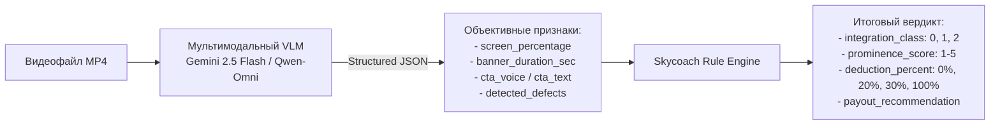

# Этап 3. Мультимодальный AI-движок и детерминированный Rule Engine

## 1. Цели этапа
1. Спроектировать двухзвенный пайплайн анализа: **«Восприятие (VLM) $\to$ Детерминированное решение (Rule Engine)»**.
2. Разработать системный промпт для мультимодальной нейросети, воспринимающей одновременно видеоряд и аудиодорожку.
3. Обеспечить строгую валидацию структурированного вывода нейросети через Pydantic-схемы (Structured Outputs / JSON Schema).
4. Закодировать строгие правила внутреннего регламента выплат Skycoach (на основе реального датасета `banner_review_examples.pdf`):
   - Штраф 20% за обрезку баннера по краям кадра;
   - Штраф 30% (или 20%) за слишком мелкий размер баннера;
   - Штраф 20% за перекрытие баннера интерфейсом Reels или вырезом камеры;
   - Полное исключение из оплаты (штраф 100%), если баннер не виден или полностью перекрыт.

---

## 2. Архитектура: разделение восприятия и бизнес-логики

> [!IMPORTANT]
> **Почему нельзя доверять расчет штрафов напрямую LLM:**
> Языковые модели подвержены случайным колебаниям (галлюцинациям) при вычислении процентов и принятии финансовых решений. 
> 
> **Архитектурный паттерн:**
> 1. **VLM (Нейросеть)** отвечает исключительно за *детекцию объективных признаков* (есть ли логотип, сколько секунд длится показ, какая площадь баннера, какие артефакты видны, есть ли CTA, какой промокод).
> 2. **Rule Engine (Детерминированный движок правил)** принимает эти признаки на вход и по жестким математическим формулам вычисляет итоговый класс, процент удержания и статус выплаты.



---

## 3. Схема структурированного вывода от VLM (`src/schemas/analysis.py`)

```python
from pydantic import BaseModel, Field
from typing import List, Optional
from src.models.enums import BannerDefect


class VlmRawObservation(BaseModel):
    """Сырые наблюдения VLM-модели по результатам просмотра видео."""

    has_skycoach_mention: bool = Field(
        description="Присутствует ли в ролике логотип, надпись или упоминание Skycoach"
    )
    is_product_advertised: bool = Field(
        description="Рекламируется ли конкретный продукт/услуга (бустинг, валюта, рейды, прокачка), а не просто логотип"
    )
    banner_duration_seconds: float = Field(
        description="Суммарная длительность отображения логотипа или баннера в секундах"
    )
    screen_percentage: float = Field(
        description="Примерный процент площади кадра, занимаемый баннером (от 0.0 до 100.0)"
    )
    has_voice_cta: bool = Field(
        description="Произносит ли автор голосом призыв к действию (заказывайте, ссылка в шапке, промокод)"
    )
    has_text_cta: bool = Field(
        description="Присутствует ли на экране текстовый призыв к действию или промокод"
    )
    promo_code: Optional[str] = Field(
        default=None,
        description="Точный текст распознанного промокода, если имеется (например, 'VALFUN')",
    )
    observed_defects: List[BannerDefect] = Field(
        default_factory=list, description="Список визуальных дефектов размещения баннера"
    )
    visual_observations: str = Field(
        description="Краткое описание размещения баннера, расположения в кадре и контекста игры"
    )
```

---

## 4. Системный промпт для мультимодальной модели (`src/services/ai/prompts.py`)

```python
SKYCOACH_SYSTEM_PROMPT = """
Ты — экспертный аналитик рекламных интеграций в Instagram Reels для игрового маркетплейса Skycoach (бустинг, игровая валюта, коучинг в WoW, Valorant, Destiny 2, PoE и др.).

Твоя задача — внимательно просмотреть видеоролик (видеоряд и звук) и выявить наличие рекламы Skycoach, оценить параметры баннера и зафиксировать возможные дефекты.

КРИТЕРИИ ОЦЕНКИ И ДЕФЕКТОВ (Регламент Skycoach):
1. Наличие Skycoach:
   - Ищи оранжево-белый/синий логотип Skycoach, надписи "Skycoach", ссылки "skycoach.gg", баннеры с персонажами игр и промокодами.
2. Продукт vs Упоминание:
   - Если показан только логотип без описания услуг — это упоминание.
   - Если автор говорит про покупку золота/буста/рангов или на баннере написано "Best Boosting Service", указан промокод или скидка — это реклама продукта.
3. Дефекты баннера (ВАЖНО!):
   - 'cut_off_edge': баннер обрезан левым, правым или верхним краем экрана, часть логотипа или текста срезана.
   - 'too_small': баннер слишком мелкий (занимает менее 4-5% экрана), текст плохо различим.
   - 'overlapped_by_ui': баннер размещен слишком низко или близко к краям, из-за чего перекрывается кнопками Reels (лайк, коммент), описанием профиля, звуковой дорожкой или вырезом фронтальной камеры смартфона.
   - 'not_visible': баннер вообще не виден, полностью перекрыт геймплеем или элементами интерфейса.

Отвечай строго в формате JSON, соответствующем предоставленной JSON-схеме.
"""
```

---

## 5. Детерминированный Rule Engine (`src/services/rules/engine.py`)

Модуль правил транслирует сырые визуальные наблюдения нейросети в финансово значимые параметры для инфлюенс-менеджера:

```python
from typing import Tuple, List
from src.models.enums import IntegrationClass, BannerDefect
from src.schemas.analysis import VlmRawObservation
from src.models.analysis import IntegrationAnalysis


class SkycoachRuleEngine:
    @classmethod
    def evaluate(cls, obs: VlmRawObservation) -> IntegrationAnalysis:
        # 1. Определение класса интеграции (0, 1, 2)
        if not obs.has_skycoach_mention:
            integration_class = IntegrationClass.NONE
        elif obs.is_product_advertised:
            integration_class = IntegrationClass.DIRECT_AD
        else:
            integration_class = IntegrationClass.MENTION

        # Если рекламы нет вообще (Класс 0)
        if integration_class == IntegrationClass.NONE:
            return IntegrationAnalysis(
                integration_class=IntegrationClass.NONE,
                prominence_score=1,
                banner_duration_seconds=0.0,
                screen_percentage=0.0,
                has_voice_cta=False,
                has_text_cta=False,
                promo_code=None,
                defects=[],
                deduction_percent=100,
                payout_recommendation="Excluded / No mention",
                reasoning="В ролике не обнаружено признаков присутствия бренда Skycoach (логотип, текст, голос отсутствуют).",
            )

        # 2. Расчет базовой заметности (Prominence Score 1-5)
        prominence_score = cls._calculate_prominence(obs)

        # 3. Расчет удержаний и штрафов по регламенту Skycoach
        deduction_percent, defects, recommendation = cls._calculate_deductions(obs)

        # 4. Формирование человекочитаемого обоснования
        reasoning = cls._build_reasoning(
            obs, integration_class, prominence_score, defects, recommendation
        )

        return IntegrationAnalysis(
            integration_class=integration_class,
            prominence_score=prominence_score,
            banner_duration_seconds=obs.banner_duration_seconds,
            screen_percentage=obs.screen_percentage,
            has_voice_cta=obs.has_voice_cta,
            has_text_cta=obs.has_text_cta,
            promo_code=obs.promo_code,
            defects=defects,
            deduction_percent=deduction_percent,
            payout_recommendation=recommendation,
            reasoning=reasoning,
        )

    @staticmethod
    def _calculate_prominence(obs: VlmRawObservation) -> int:
        """Расчет заметности рекламы от 1 до 5."""
        dur = obs.banner_duration_seconds
        area = obs.screen_percentage
        has_cta = obs.has_voice_cta or obs.has_text_cta

        if dur < 2.0 and area < 5.0:
            return 1
        elif dur < 5.0 and not has_cta:
            return 2
        elif dur >= 10.0 and area >= 12.0 and obs.has_voice_cta:
            return 5
        elif (dur >= 7.0 and area >= 8.0) or (has_cta and area >= 7.0):
            return 4
        else:
            return 3

    @staticmethod
    def _calculate_deductions(obs: VlmRawObservation) -> Tuple[int, List[BannerDefect], str]:
        """Расчет штрафов в соответствии с banner_review_examples.pdf."""
        defects = obs.observed_defects.copy()

        # Краевой дефект: Баннер не виден вообще
        if BannerDefect.NOT_VISIBLE in defects or obs.screen_percentage < 1.0:
            return 100, [BannerDefect.NOT_VISIBLE], "Excluded (Banner not visible)"

        # Автоматическая детекция мелкого баннера по площади
        if obs.screen_percentage < 4.0 and BannerDefect.TOO_SMALL not in defects:
            defects.append(BannerDefect.TOO_SMALL)

        deduction = 0
        reasons = []

        if BannerDefect.CUT_OFF_EDGE in defects:
            deduction += 20
            reasons.append("Banner cut off on the edge (-20%)")

        if BannerDefect.OVERLAPPED_BY_UI in defects:
            deduction += 20
            reasons.append("Banner overlapped by UI / camera (-20%)")

        if BannerDefect.TOO_SMALL in defects:
            # 30% если очень мелкий, 20% если незначительно
            small_penalty = 30 if obs.screen_percentage < 3.5 else 20
            deduction += small_penalty
            reasons.append(f"Banner too small (-{small_penalty}%)")

        # Ограничение максимального удержания
        deduction = min(deduction, 100)

        if deduction == 0:
            recommendation = "Full payout (No deduction)"
        elif deduction >= 100:
            recommendation = "Excluded (Multiple severe defects)"
        else:
            recommendation = f"{deduction}% deduction: {', '.join(reasons)}"

        return deduction, defects, recommendation

    @staticmethod
    def _build_reasoning(
        obs: VlmRawObservation,
        integration_class: IntegrationClass,
        score: int,
        defects: List[BannerDefect],
        recommendation: str,
    ) -> str:
        parts = [
            f"Класс {integration_class.value} ({'Прямая реклама продукта' if integration_class == 2 else 'Упоминание бренда'}).",
            f"Заметность: {score}/5.",
            f"Баннер в кадре: ~{obs.banner_duration_seconds:.1f} сек, занимает ~{obs.screen_percentage:.1f}% площади экрана.",
        ]
        if obs.has_voice_cta:
            parts.append("Присутствует голосовой призыв к действию (CTA).")
        if obs.has_text_cta:
            parts.append("Присутствует текстовый призыв / баннер с оффером.")
        if obs.promo_code:
            parts.append(f"Обнаружен промокод: '{obs.promo_code}'.")

        if defects:
            defect_names = [d.value for d in defects]
            parts.append(f"Обнаружены дефекты размещения: {', '.join(defect_names)}.")

        parts.append(f"Рекомендация по выплате: {recommendation}.")
        return " ".join(parts)
```

---

## 6. Чек-лист готовности Этапа 3
- [ ] Разработан системный промпт с описанием классов 0, 1, 2 и дефектов баннера.
- [ ] Описана Pydantic-схема `VlmRawObservation` для Structured Outputs.
- [ ] Реализован класс `SkycoachRuleEngine` с жестким расчетом штрафов 20%, 30%, 100%.
- [ ] Формируется подробный текст `reasoning`, объясняющий секунды, % кадра, CTA и причину удержания.
- [ ] Протестированы краевые кейсы (ролик без Skycoach $\to$ Класс 0, невидимый баннер $\to$ 100% удержание).
