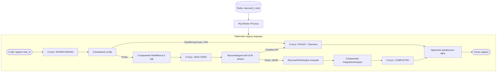

# Этап 4. Фоновая очередь, воркер и слой кэширования (Idempotency)

## 1. Цели этапа
1. Настроить надежную асинхронную обработку задач через **Redis** и **RQ (Redis Queue)** без блокировки основного веб-сервера.
2. Реализовать полный цикл воркера: скачивание $\to$ AI-анализ $\to$ правила $\to$ запись в БД $\to$ очистка файлов.
3. Разработать уровень строгой идемпотентности и кэширования: повторная отправка того же URL не ставит задачу в очередь повторно, а мгновенно отдает существующий результат.
4. Предотвратить «гонку» параллельных запросов (in-flight deduplication) при одновременной отправке одинаковых ссылок.
5. Обеспечить жесткие таймауты (180 сек), гарантирующие, что воркер никогда не зависнет на «мертвой» задаче.

---

## 2. Архитектура очереди и воркера



---

## 3. Модуль очереди (`src/workers/queue.py`)

```python
import redis
from rq import Queue
from src.config import settings

redis_conn = redis.from_url(settings.REDIS_URL)

# Основная очередь с задачами анализа Reels
reel_task_queue = Queue(
    name="skycoach_reels",
    connection=redis_conn,
    default_timeout=settings.TASK_TIMEOUT_SECONDS,  # 180 секунд
)


def enqueue_reel_analysis(task_id: str) -> None:
    """Ставит задачу в очередь на обработку."""
    reel_task_queue.enqueue(
        "src.workers.tasks.process_reel_task",
        task_id=task_id,
        job_timeout=settings.TASK_TIMEOUT_SECONDS,
        result_ttl=86400,  # Хранение метаданных задачи в Redis 24 часа
    )
```

---

## 4. Пайплайн воркера (`src/workers/tasks.py`)

```python
import os
import shutil
import logging
from uuid import UUID
from sqlalchemy import select
from src.database import AsyncSessionLocal
from src.models.task import Task
from src.models.enums import TaskStatus
from src.services.extractor.ytdlp_extractor import YtDlpExtractor
from src.services.extractor.exceptions import ExtractorError
from src.services.ai.vlm_client import VlmClient
from src.services.rules.engine import SkycoachRuleEngine

logger = logging.getLogger("worker")


async def process_reel_task(task_id: str):
    """Главная функция обработки одной задачи в воркере."""
    async with AsyncSessionLocal() as session:
        # 1. Получение задачи из БД
        stmt = select(Task).where(Task.id == task_id)
        result = await session.execute(stmt)
        task = result.scalar_one_or_none()

        if not task:
            logger.error("Задача %s не найдена в базе данных", task_id)
            return

        # 2. Перевод в статус DOWNLOADING
        task.status = TaskStatus.DOWNLOADING
        await session.commit()

        video_path = None
        temp_dir = None

        try:
            # 3. Извлечение метрик и скачивание видео
            extractor = YtDlpExtractor()
            metrics, video_path, has_audio = extractor.extract_info_and_download(task.canonical_url)
            temp_dir = os.path.dirname(video_path)

            # Сохранение метрик ролика
            task.metrics = metrics
            task.status = TaskStatus.ANALYZING
            await session.commit()

            # 4. Мультимодальный AI-анализ
            vlm = VlmClient()
            raw_obs = await vlm.analyze_video(video_path=video_path, has_audio=has_audio)

            # 5. Применение бизнес-правил Skycoach
            analysis = SkycoachRuleEngine.evaluate(raw_obs)
            task.analysis = analysis
            task.status = TaskStatus.COMPLETED
            task.error_message = None
            await session.commit()
            logger.info("Задача %s успешно выполнена!", task_id)

        except ExtractorError as e:
            logger.warning("Ошибка экстрактора для задачи %s: %s", task_id, e.user_friendly_message)
            task.status = TaskStatus.FAILED
            task.error_message = e.user_friendly_message
            await session.commit()

        except Exception as e:
            logger.exception("Непредвиденная ошибка в задаче %s: %s", task_id, e)
            task.status = TaskStatus.FAILED
            task.error_message = f"Внутренняя ошибка сервиса: {str(e)[:120]}"
            await session.commit()

        finally:
            # 6. Гарантированная очистка временного файла MP4
            if temp_dir and os.path.exists(temp_dir):
                try:
                    shutil.rmtree(temp_dir, ignore_errors=True)
                    logger.info("Временные файлы задачи %s удалены", task_id)
                except Exception as e:
                    logger.warning("Ошибка очистки временного каталога %s: %s", temp_dir, e)
```

---

## 5. Слой кэширования и дедупликации (`src/services/cache_service.py`)

Согласно требованию ТЗ: *«Повторная отправка той же ссылки не запускает обработку заново, а отдаёт готовый результат»*.

```python
from typing import Optional, Tuple
from sqlalchemy import select, and_
from sqlalchemy.ext.asyncio import AsyncSession
from src.models.task import Task
from src.models.enums import TaskStatus


class TaskCacheService:
    @staticmethod
    async def find_existing_completed_task(
        session: AsyncSession, canonical_url: str
    ) -> Optional[Task]:
        """
        Ищет ранее успешно завершенную задачу по каноническому URL.
        """
        stmt = (
            select(Task)
            .where(and_(Task.canonical_url == canonical_url, Task.status == TaskStatus.COMPLETED))
            .order_by(Task.created_at.desc())
            .limit(1)
        )
        res = await session.execute(stmt)
        return res.scalar_one_or_none()

    @staticmethod
    async def find_active_in_flight_task(
        session: AsyncSession, canonical_url: str
    ) -> Optional[Task]:
        """
        Проверяет, выполняется ли сейчас задача для этого же URL (дедупликация на лету).
        """
        stmt = (
            select(Task)
            .where(
                and_(
                    Task.canonical_url == canonical_url,
                    Task.status.in_(
                        [TaskStatus.PENDING, TaskStatus.DOWNLOADING, TaskStatus.ANALYZING]
                    ),
                )
            )
            .order_by(Task.created_at.desc())
            .limit(1)
        )
        res = await session.execute(stmt)
        return res.scalar_one_or_none()
```

---

## 6. Запуск воркера (Supervisor)

Воркер запускается отдельной командой (как в Docker Compose, так и на Render/Railway):
```bash
# Запуск через uv в окружении проекта
uv run rq worker skycoach_reels --with-scheduler --url redis://localhost:6379/0
```

---

## 7. Чек-лист готовности Этапа 4
- [ ] Очередь `skycoach_reels` настроена в Redis с таймаутом 180 сек.
- [ ] Пайплайн воркера изолирован и последовательно меняет статусы: `PENDING` $\to$ `DOWNLOADING` $\to$ `ANALYZING` $\to$ `COMPLETED` / `FAILED`.
- [ ] Кэширование по `canonical_url` проверено: повторный ввод возвращает готовый объект за 0 мс.
- [ ] Дедупликация параллельных запросов предотвращает повторные запуски воркера.
- [ ] Очистка диска от mp4 срабатывает гарантированно в блоке `finally`.
