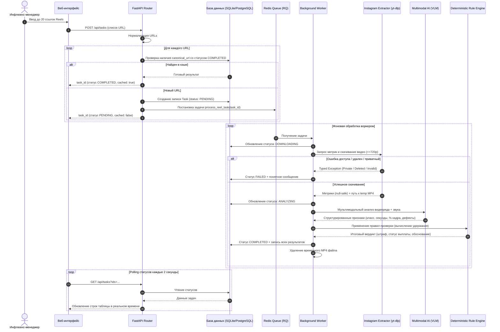

# Документация архитектуры и этапов разработки: Skycoach Reels Ad Analyzer

Данная директория содержит исчерпывающее пошаговое описание архитектурных решений, интерфейсов, моделей данных, логики обработки и инструкций по реализации для каждого этапа проекта **Skycoach Reels Ad Analyzer**.

---

## Навигация по этапам разработки

| № | Файл | Ключевой фокус | Результат этапа |
|---|---|---|---|
| **01** | [`01_project_init_and_models.md`](./01_project_init_and_models.md) | Архитектура проекта, стек, управление зависимостями (`uv`), Pydantic/SQLAlchemy модели данных и схемы БД | Готовая структура репозитория, доменные модели `Task`, `ReelMetrics`, `IntegrationAnalysis`, enum-типы |
| **02** | [`02_media_extraction_and_edge_cases.md`](./02_media_extraction_and_edge_cases.md) | Модуль экстрактора (`yt-dlp`), нормализация ссылок, парсинг метрик с `null`, типизированные ошибки краевых случаев | Сервис скачивания видео (720p/480p) и извлечения метрик, обработка приватных/удаленных/битых ссылок |
| **03** | [`03_ai_engine_and_rule_layer.md`](./03_ai_engine_and_rule_layer.md) | Мультимодальный AI-пайплайн (VLM), промпт-инжиниринг, Structured Output и детерминированный Rule Engine удержаний | Классификатор (0, 1, 2), шкала заметности (1–5) с обоснованием, детекция дефектов баннера |
| **04** | [`04_queue_worker_and_cache.md`](./04_queue_worker_and_cache.md) | Асинхронные очереди (Redis + RQ), воркеры, таймауты, идемпотентность и кэширование по `canonical_url` | Фоновый воркер, изоляция задач, мгновенная отдача результатов из кэша без повторного анализа |
| **05** | [`05_api_and_frontend.md`](./05_api_and_frontend.md) | REST API (FastAPI) и веб-интерфейс для инфлюенс-менеджера (Tailwind + Polling) | Эндпоинты `/api/tasks`, `/api/export`, UI с пакетным вводом до 20 ссылок, автообновлением и готовыми примерами |
| **06** | [`06_acceptance_testing_and_qa.md`](./06_acceptance_testing_and_qa.md) | Комплекс автотестов (`pytest`), верификация приёмочных критериев и проверка на ручной разметке баннеров | 100% покрытие приёмочных кейсов (приватный, удаленный, без звука, длинный, дубликат, невалидный) |
| **07** | [`07_docker_deployment_and_docs.md`](./07_docker_deployment_and_docs.md) | Мультистейдж `Dockerfile`, `docker-compose`, развертывание на публичный хостинг (Railway/Render) и `README.md` | Готовый публичный сервис с HTTPS, документация по запуску и архитектурный отчет для ревью |

---

## Общая схема потоков данных (Data Flow)

